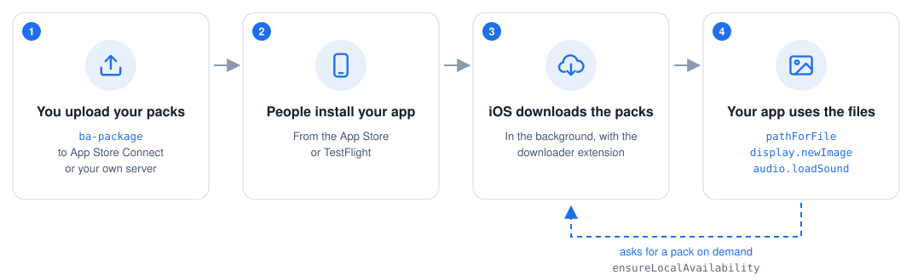
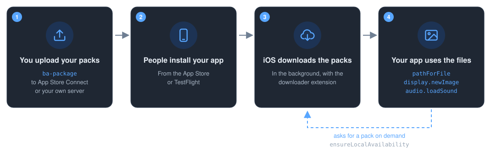
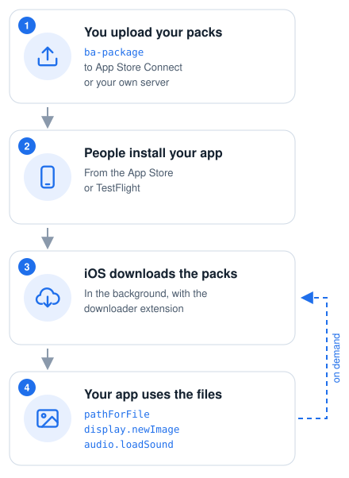
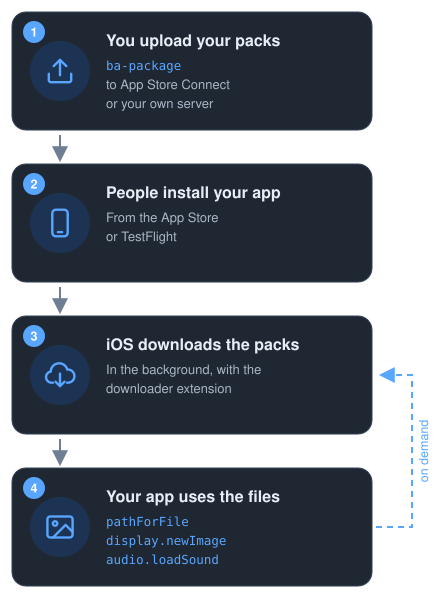

:og:description: Apple's managed Background Assets for Solar2D apps (iOS 26 and later): download asset packs after install, Apple-hosted or self-hosted, and load their images and sounds.

.. meta::
   :description: Apple's managed Background Assets for Solar2D apps (iOS 26 and later): download asset packs after install, Apple-hosted or self-hosted, and load their images and sounds.

Background Assets plugin for Solar2D
====================================

``plugin.backgroundAssets`` (publisher ``com.studycat``) brings Apple's managed Background Assets API (iOS 26 and
later) to Solar2D apps. An app uses it to download asset packs (groups of images, sounds and other files) after it is
installed, and to load the files they contain.

Either Apple hosts the packs, which you upload to App Store Connect, or you host them on your own HTTPS server. The app
chooses between the two in its setup (see :doc:`setup` and :doc:`self-hosting`).

The plugin loads from iOS 13. Below iOS 26, ``getCapabilities().isSupported`` is ``false`` and every other call reports
the ``unsupported`` error, except ``setDelegate``, which is accepted but never calls its listener (see :doc:`api`). In
the Solar2D Simulator, the plugin runs over a folder emulator of Background Assets that the app configures from Lua
(see :doc:`simulator`).

How it works
------------

ck on demand.

ck on demand.

ck on demand.

ck on demand.

Guide
-----

.. grid:: 1 2 2 3
   :gutter: 3

   .. grid-item-card:: Quickstart
      :link: quickstart
      :link-type: doc

      Install the plugin, download a pack and show one of its images.

   .. grid-item-card:: App setup
      :link: setup
      :link-type: doc

      Toolchains, Info.plist keys, entitlements and the downloader extension.

   .. grid-item-card:: Asset packs
      :link: packs
      :link-type: doc

      Build packs with ``ba-package``, upload them to App Store Connect and test them with ``ba-serve``.

   .. grid-item-card:: Self-hosting
      :link: self-hosting
      :link-type: doc

      Serve the packs from your own HTTPS server.

   .. grid-item-card:: Files
      :link: files
      :link-type: doc

      Load a pack's images, sounds and other files.

   .. grid-item-card:: Simulator
      :link: simulator
      :link-type: doc

      Run the app in the Solar2D Simulator over local pack sources.

Reference
---------

.. grid:: 1 2 2 3
   :gutter: 3

   .. grid-item-card:: Lua API
      :link: api
      :link-type: doc

      Every call, event and error of ``plugin.backgroundAssets``.

   .. grid-item-card:: Emulator
      :link: emulator
      :link-type: doc

      The Simulator's folder emulator: its module, options and behaviour.

   .. grid-item-card:: Naming
      :link: naming
      :link-type: doc

      How the calls are named, and every way the API departs from Apple's.

   .. grid-item-card:: Troubleshooting
      :link: troubleshooting
      :link-type: doc

      Common failures, what causes them and how to fix them.

   .. grid-item-card:: For backend authors
      :link: backend
      :link-type: doc

      The contract between the Lua front and a platform backend.

.. toctree::
   :maxdepth: 1
   :caption: Guide
   :hidden:

   quickstart
   setup
   packs
   self-hosting
   files
   simulator

.. toctree::
   :maxdepth: 1
   :caption: Reference
   :hidden:

   api
   emulator
   naming
   troubleshooting

.. toctree::
   :maxdepth: 1
   :caption: For backend authors
   :hidden:

   backend
